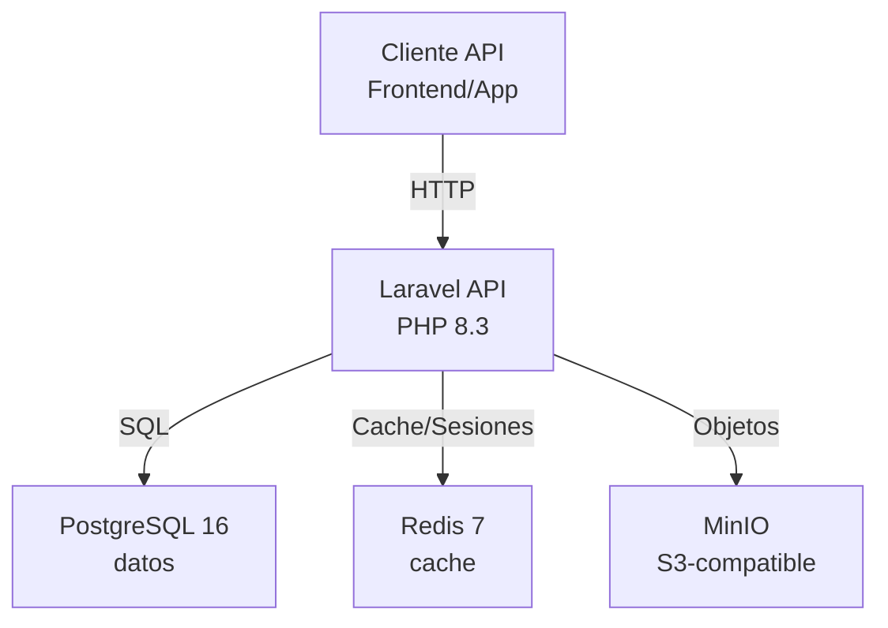
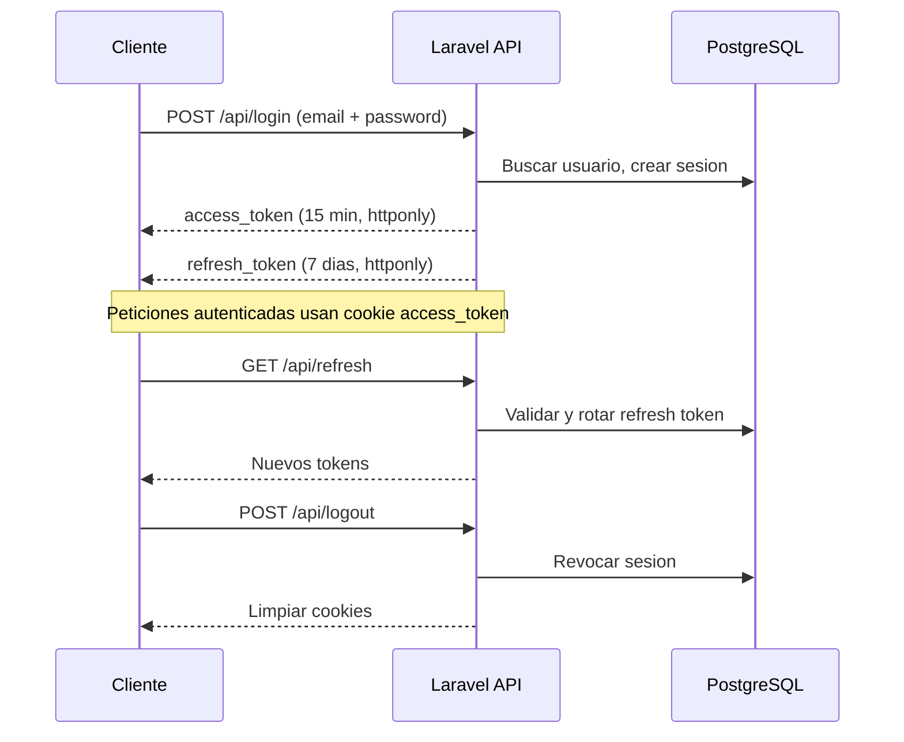
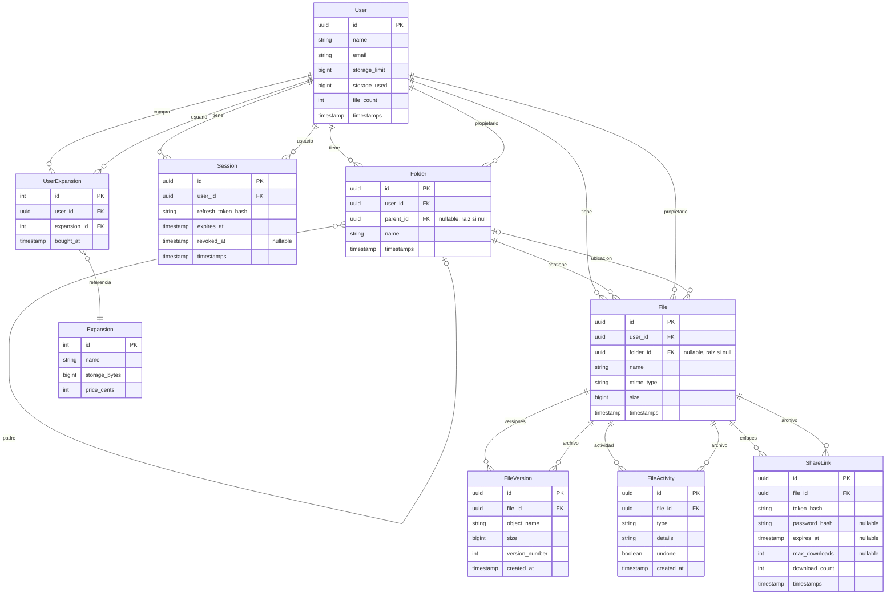

# SzCloud API

API REST para un servicio de almacenamiento en la nube. Permite a los usuarios registrar cuentas, gestionar archivos y carpetas con versionado, compartir enlaces de descarga, y ampliar su capacidad de almacenamiento.

## Stack tecnologico

| Componente       | Tecnologia                         |
|------------------|------------------------------------|
| Lenguaje         | PHP 8.3+                           |
| Framework        | Laravel 13                         |
| Base de datos    | PostgreSQL 16                      |
| Cache/Sesiones   | Redis 7 (via predis)               |
| Almacenamiento   | MinIO (compatibile S3)             |
| Autenticacion    | JWT (php-open-source-saver/jwt-auth) |
| Documentacion    | L5-Swagger (OpenAPI 3.0)           |
| Frontend assets  | Vite 8 + Tailwind CSS 4            |
| Cola de trabajos | Redis                              |

## Estructura del proyecto

```
SzCloudApi/
|-- app/
|   |-- Console/Commands/         Artisan commands (EnsureBucket)
|   |-- Dtos/                     Data Transfer Objects (FolderDto)
|   |-- Http/
|   |   |-- Controllers/          Controladores (Auth, User, Storage, Expansion, ShareLink)
|   |   |-- Requests/             Form Requests (validacion por dominio)
|   |   |-- Swagger/              Configuracion OpenAPI
|   |-- Jobs/                     Trabajos en cola (CleanupOrphanMinIOFiles, DeleteExpiredTrash)
|   |-- Models/                   Modelos Eloquent (User, File, Folder, etc.)
|   |-- Providers/                Service Providers de Laravel
|   |-- Services/                 Logica de negocio
|   |-- utils/                    Utilidades (Security, MinIOHelper, LoggerHelper, NameSanitizer)
|-- config/                       Archivos de configuracion de Laravel
|-- database/
|   |-- migrations/               Migraciones de la base de datos
|   |-- seeders/                  Seeders (ExpansionSeeder)
|-- docker/                       Archivos de soporte para Docker
|-- docs/                         Documentacion del proyecto
|-- public/                       Documento raiz del servidor web
|-- resources/                    Assets del frontend (Vite)
|-- routes/
|   |-- api.php                   Entrada de rutas de la API
|   |-- api/                      Rutas agrupadas por dominio
|-- tests/                        Pruebas PHPUnit
|-- docker-compose.yml            Orquestacion de servicios
|-- Dockerfile                    Imagen del contenedor PHP
```

## Arquitectura





## Requisitos previos

- PHP 8.3 o superior
- Composer
- Node.js 20+
- PostgreSQL 16
- Redis 7
- MinIO (o cualquier servicio S3-compatible)

## Instalacion y ejecucion

### Con Docker (recomendado)

```bash
# Clonar el repositorio
git clone <url-del-repositorio>
cd SzCloudApi

# Copiar variables de entorno
cp .env.example .env

# Levantar servicios
docker-compose up -d

# El contenedor ejecutara migraciones, seeders y creara el bucket automaticamente
# La API estara disponible en http://localhost:8000
```

### Instalacion local

```bash
# Clonar el repositorio
git clone <url-del-repositorio>
cd SzCloudApi

# Instalar dependencias PHP
composer install

# Instalar dependencias Node
npm install

# Configurar variables de entorno
cp .env.example .env
php artisan key:generate

# Ejecutar migraciones y seeders
php artisan migrate --seed

# Crear bucket de MinIO
php artisan storage:ensure-bucket

# Compilar assets del frontend
npm run build
```

### Desarrollo

```bash
# Ejecutar todos los servicios en paralelo (servidor, cola, logs, Vite)
composer dev
```

Esto ejecuta simultaneamente:
- `php artisan serve` -- servidor HTTP
- `php artisan queue:listen` -- procesador de colas
- `php artisan pail` -- visualizacion de logs en tiempo real
- `npm run dev` -- compilador Vite con hot reload

### Pruebas

```bash
composer test
```

### Scripts disponibles

| Comando          | Descripcion                                      |
|------------------|--------------------------------------------------|
| `composer setup` | Instala todo: dependencias, .env, migraciones, npm |
| `composer dev`   | Ejecuta todos los servicios de desarrollo         |
| `composer test`  | Limpia cache de configuracion y ejecuta pruebas   |

## Variables de entorno

Las variables principales se encuentran en `.env.example`. Las mas importantes:

| Variable              | Descripcion                              | Ejemplo                          |
|-----------------------|------------------------------------------|----------------------------------|
| `APP_KEY`             | Clave de cifrado de Laravel              | (generada con `key:generate`)    |
| `DB_CONNECTION`       | Driver de base de datos                  | `pgsql`                          |
| `DB_HOST`             | Host de PostgreSQL                       | `127.0.0.1`                      |
| `DB_PORT`             | Puerto de PostgreSQL                     | `5432`                           |
| `DB_DATABASE`         | Nombre de la base de datos               | `szcloud`                        |
| `DB_USERNAME`         | Usuario de PostgreSQL                    | `root`                           |
| `DB_PASSWORD`         | Contrasena de PostgreSQL                 |                                  |
| `REDIS_HOST`          | Host de Redis                            | `127.0.0.1`                      |
| `REDIS_PORT`          | Puerto de Redis                          | `6379`                           |
| `MINIO_ROOT_USER`     | Usuario de MinIO                         | `minioadmin`                     |
| `MINIO_ROOT_PASSWORD` | Contrasena de MinIO                      | `minioadmin`                     |
| `MINIO_ENDPOINT`      | Endpoint interno de MinIO                | `http://localhost:9000`           |
| `MINIO_PUBLIC_ENDPOINT` | Endpoint publico de MinIO              | `http://localhost:9000`           |
| `MINIO_BUCKET`        | Nombre del bucket                        | `szcloud`                        |
| `FRONTEND_URL`        | URL del frontend (para share links)      | `http://localhost:3000`           |

Los tokens JWT se gestionan via cookies httponly con los siguientes TTLs configurados en `app/utils/Security.php`:

- Access Token: 15 minutos
- Refresh Token: 7 dias

## Endpoints de la API

Todas las rutas estan prefijadas con `/api`. Las rutas estan organizadas por dominio en archivos separados dentro de `routes/api/`.

| Dominio              | Archivo                | Auth requerida |
|----------------------|------------------------|----------------|
| Autenticacion        | `AuthRoutes.php`       | Parcial        |
| Gestion de usuario   | `UserRoutes.php`       | Si             |
| Almacenamiento       | `StorageRoutes.php`    | Si             |
| Expansiones          | `ExpansionRoutes.php`  | Parcial        |
| Enlaces compartidos  | `ShareLinkRoutes.php`  | Parcial        |

Documentacion completa de endpoints: **[routes/README.md](routes/README.md)**

## Modelos de datos



## Funcionalidades clave

### Versionado de archivos

Cada vez que un archivo se reemplaza, se preserva la version anterior. Se mantienen hasta 3 versiones; la mas antigua se elimina automaticamente. Se soportan:

- Restaurar version anterior (Ctrl+Z)
- Restaurar version posterior (Ctrl+Shift+Z)
- Verificar disponibilidad de versiones

### Historial de actividad

Cada cambio en un archivo (creacion, renombre, movimiento, cambio de contenido) se registra en `FileActivity`. Se mantienen hasta 3 registros de actividad. Se soporta:

- Deshacer ultima accion
- Rehacer ultima accion deshecha

### Gestion de papelera

Los archivos y carpetas se eliminan con soft delete. La papelera retiene elementos por 30 dias antes de eliminacion permanente. El job `DeleteExpiredTrash` se encarga de la limpieza automatica.

### Fusion de carpetas

Al crear, mover o renombrar una carpeta con un nombre que ya existe en el destino, las carpetas se fusionan: el contenido de la carpeta con menos elementos se migra a la existente.

### Enlaces compartidos

Los enlaces de comparticion soportan:

- Expiracion por fecha
- Limite de descargas
- Proteccion por contrasena
- Revocacion manual

Los tokens se almacenan como hash SHA-256, nunca en texto plano.

### Limpieza de archivos huerfanos

El job `CleanupOrphanMinIOFiles` recorre el bucket de MinIO y elimina archivos que no estan referenciados ni en `files` ni en `file_versions`.

## Comandos Artisan personalizados

| Comando                    | Descripcion                                |
|----------------------------|--------------------------------------------|
| `storage:ensure-bucket`    | Crea el bucket de MinIO si no existe       |

## Documentacion Swagger

La documentacion OpenAPI 3.0 esta disponible en los controladores via atributos PHP 8 del paquete `l5-swagger`. Para generar la documentacion:

```bash
php artisan l5-swagger:generate
```

La interfaz UI estara disponible en `/api/documentation` (configurar en `config/l5-swagger.php`).

## Notas importantes

- Los tokens de autenticacion se manejan exclusivamente via cookies httponly, no en el header Authorization. Esto mejora la seguridad frente a ataques XSS.
- El access token expira a los 15 minutos. El refresh token dura 7 dias y se rota en cada renovacion.
- La sesion tiene un limite de vida util de 30 dias desde su creacion.
- Los nombres de archivos y carpetas no pueden contener los caracteres: `/ \ : " ' < > |`. El endpoint `check-name` permite verificar conflictos antes de crear/mover/renombrar.
- Subida directa: limite de 10MB (`max:10485760` bytes), una sola peticion multipart. Para archivos grandes se dispone de subida por chunks (multipart S3, 5MB por chunk) sin limite practico de tamano.
- Todos los IDs de modelos (excepto Expansion) son UUIDs.
- La eliminacion de usuarios elimina todos sus archivos, carpetas, enlaces y sesiones de forma permanente.

## Rutas de acceso web

| Ruta                    | Descripcion                                      |
|-------------------------|--------------------------------------------------|
| `http://localhost:8000` | Home / pagina principal de Laravel               |
| `http://localhost:8000/api/documentation` | Documentacion Swagger UI (OpenAPI 3.0) |
| `http://localhost:8000/test` | API Tester -- interfaz web para probar endpoints |

### Uso de Swagger

Para probar endpoints autenticados desde Swagger UI:

1. Abrir `http://localhost:8000/api/documentation`
2. Hacer login desde el endpoint `POST /api/login` con credenciales validas
3. Al iniciar sesion, se genera una cookie httponly con el access token
4. Swagger automaticamente incluira esa cookie en las siguientes peticiones
5. No es necesario configurar headers manualmente -- la autenticacion se gestiona por cookies

### API Tester (`/test`)

Interfaz web integrada para probar los endpoints de la API sin herramientas externas. Accede a `http://localhost:8000/test`.

**Funcionalidades:**

- **Selector de metodo y URL**: elegir GET, POST, PUT, PATCH o DELETE e ingresar la ruta del endpoint (ej. `/api/me`)
- **Body**: soporta JSON, Form Data o None
- **Headers**: agregar headers customizados a la peticion
- **Auth**: login y logout con gestion automatica de cookies httponly. Inicia sesion desde el modal de login con credenciales validas
- **Acciones rapidas**: botones preconfigurados para `/me`, `/refresh`, `/storage/info`, `/folders`, `/trash`, `/logout`
- **Helpers**: consultar perfil, expansiones, probar links compartidos, verificar espacio disponible, validar nombres de archivos
- **Respuesta**: visualizar el body y headers de la respuesta con codigo de estado y tiempo de respuesta
- **Consola**: registro de peticiones y respuestas en tiempo real
- **Explorador de archivos**: panel lateral para navegar, subir, mover y gestionar archivos directamente desde la interfaz
