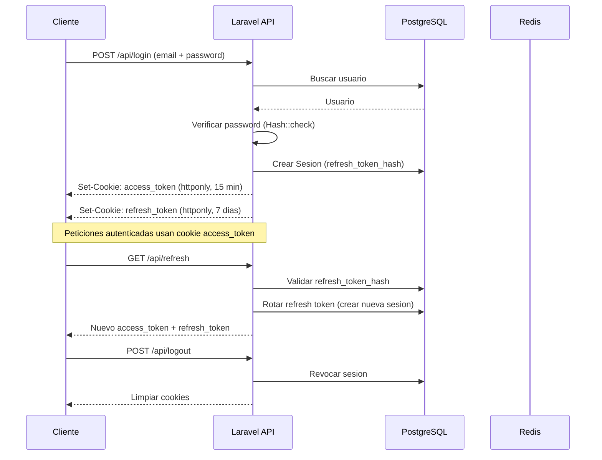

# Rutas de la API - SzCloud

Todas las rutas estan prefijadas con `/api`. Las rutas estan organizadas en archivos separados dentro de `routes/api/`:

| Archivo             | Dominio             |
|---------------------|---------------------|
| `AuthRoutes.php`    | Autenticacion       |
| `UserRoutes.php`    | Gestion de usuario  |
| `StorageRoutes.php` | Almacenamiento      |
| `ExpansionRoutes.php` | Expansiones       |
| `ShareLinkRoutes.php` | Enlaces compartidos |

## Diagrama de flujo de autenticacion

## Autenticacion

**Archivo:** `AuthRoutes.php`

| Metodo | Ruta            | Descripcion              | Auth   |
|--------|-----------------|--------------------------|--------|
| POST   | `/register`     | Registrar nuevo usuario  | No     |
| POST   | `/login`        | Iniciar sesion           | No     |
| POST   | `/refresh`      | Renovar access token     | No     |
| POST   | `/logout`       | Cerrar sesion            | Si     |
| GET    | `/me`           | Obtener usuario actual   | Si     |

## Gestion de usuario

**Archivo:** `UserRoutes.php`

| Metodo | Ruta      | Descripcion                | Auth |
|--------|-----------|----------------------------|------|
| PUT    | `/user`   | Actualizar nombre/apellido | Si   |
| PATCH  | `/user`   | Actualizar contrasena      | Si   |
| DELETE | `/user`   | Eliminar cuenta            | Si   |

## Almacenamiento -- Informacion

**Archivo:** `StorageRoutes.php`

| Metodo | Ruta               | Descripcion                           | Auth |
|--------|--------------------|---------------------------------------|------|
| GET    | `/storage/info`    | Uso de almacenamiento y plan actual   | Si   |
| POST   | `/storage/verify`  | Verificar si cabe un archivo          | Si   |

## Almacenamiento -- Carpetas

**Archivo:** `StorageRoutes.php`

| Metodo | Ruta                                    | Descripcion                              | Auth |
|--------|-----------------------------------------|------------------------------------------|------|
| GET    | `/storage/folder/check-name`            | Verificar nombre de carpeta              | Si   |
| GET    | `/storage/folder/content/{folder_id?}`  | Listar contenido de carpeta              | Si   |
| GET    | `/storage/folder/{folder_id}`           | Info de carpeta                          | Si   |
| POST   | `/storage/folder`                       | Crear carpeta                            | Si   |
| PATCH  | `/storage/folder/{folder_id}/rename`    | Renombrar carpeta                        | Si   |
| PATCH  | `/storage/folder/{folder_id?}/move`     | Mover carpeta                            | Si   |
| DELETE | `/storage/folder/{folder_id}`           | Eliminar carpeta (soft delete)           | Si   |
| POST   | `/storage/folder/{folder_id}/restore`   | Restaurar carpeta desde papelera         | Si   |
| GET    | `/storage/folders/hierarchy`            | Arbol jerarquico de carpetas             | Si   |

## Almacenamiento -- Archivos

**Archivo:** `StorageRoutes.php`

| Metodo | Ruta                                                   | Descripcion                                | Auth |
|--------|--------------------------------------------------------|--------------------------------------------|------|
| GET    | `/storage/file/check-name`                             | Verificar nombre de archivo                | Si   |
| GET    | `/storage/file/{file_id}`                              | Info de archivo                            | Si   |
| POST   | `/storage/file`                                        | Subir archivo (multipart, max 10MB)        | Si   |
| PUT    | `/storage/file/{file_id}`                              | Reemplazar contenido de archivo            | Si   |
| PATCH  | `/storage/file/{file_id}/rename`                       | Renombrar archivo                          | Si   |
| PATCH  | `/storage/file/{file_id}/move`                         | Mover archivo                              | Si   |
| DELETE | `/storage/file/{file_id}`                              | Eliminar archivo (soft delete)             | Si   |
| POST   | `/storage/file/{file_id}/restore`                      | Restaurar archivo desde papelera           | Si   |
| GET    | `/storage/file/{file_id}/download`                     | URL temporaria de descarga (30 min)         | Si   |
| GET    | `/storage/file/{file_id}/versions`                     | Lista de versiones                         | Si   |
| GET    | `/storage/file/{file_id}/versions/check`               | Verificar versiones anteriores/posteriores  | Si   |
| POST   | `/storage/file/{file_id}/versions/restore-back`        | Restaurar version anterior (Ctrl+Z)        | Si   |
| POST   | `/storage/file/{file_id}/versions/restore-front`       | Restaurar version posterior (Ctrl+Shift+Z) | Si   |
| GET    | `/storage/file/{file_id}/activity`                     | Historial de actividad                     | Si   |
| POST   | `/storage/file/{file_id}/activity/restore-back`        | Deshacer ultima accion                     | Si   |
| POST   | `/storage/file/{file_id}/activity/restore-front`       | Rehacer ultima accion deshecha             | Si   |

## Papelera

**Archivo:** `StorageRoutes.php`

| Metodo | Ruta                           | Descripcion                      | Auth |
|--------|--------------------------------|----------------------------------|------|
| GET    | `/storage/trash`               | Listar elementos en papelera     | Si   |
| DELETE | `/storage/trash`               | Vaciar papelera                  | Si   |
| DELETE | `/storage/trash/{id}/permanent`| Eliminar permanentemente         | Si   |

## Expansiones

**Archivo:** `ExpansionRoutes.php`

| Metodo | Ruta                    | Descripcion                     | Auth |
|--------|-------------------------|---------------------------------|------|
| GET    | `/expansions`           | Listar expansiones disponibles  | No   |
| GET    | `/expansions/{id}`      | Detalle de una expansion        | No   |
| POST   | `/expansions/{id}/buy`  | Comprar expansion               | Si   |

## Enlaces compartidos

**Archivo:** `ShareLinkRoutes.php`

| Metodo | Ruta                         | Descripcion                           | Auth |
|--------|------------------------------|---------------------------------------|------|
| POST   | `/share/{token}`             | Obtener URL de descarga               | No   |
| GET    | `/share/{token}/config`      | Configuracion del enlace (sin auth)   | No   |
| GET    | `/share/{token}/data`        | Datos completos del enlace            | Si   |
| POST   | `/share/file/{file_id}`      | Crear enlace compartido               | Si   |
